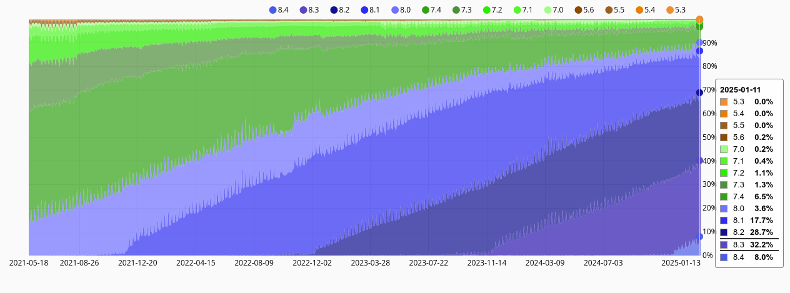
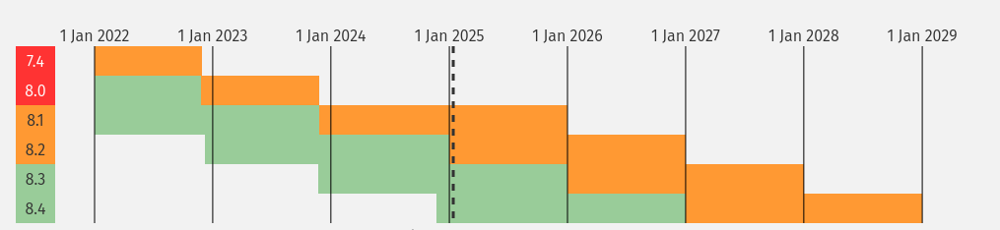

# 8.4

- 21 Nov 2024 https://www.php.net/archive/2024.php#2024-11-21-4
- 2600 commits
- 115 contributors
- Changes from 36 RFC's (!)

https://packagist.org/php-statistics

- https://github.com/php/policies
  - 2 + 2 years support
    - 1 -> 2 years security support
  - 3 alpha, 3 beta, 4 RC's
    - 6 -> 4 RC's
  - Allow minor features in beta

https://www.php.net/supported-versions.php

# References

- https://stitcher.io/blog/new-in-php-84
- https://www.youtube.com/watch?v=d2XTUwxC2xc
- https://www.php.net/releases/8.4/en.php
- https://thephp.foundation/blog/2024/11/21/php-core-roundup-20-php84/
