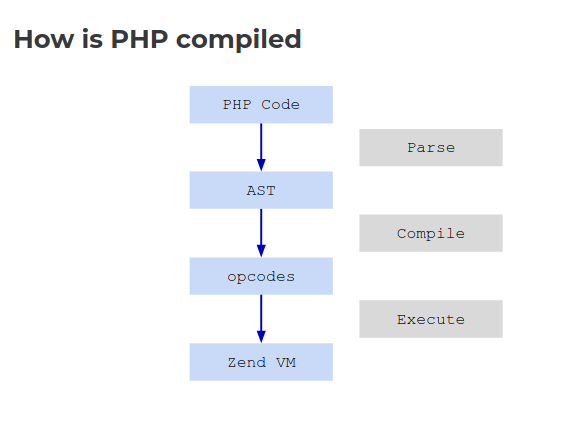
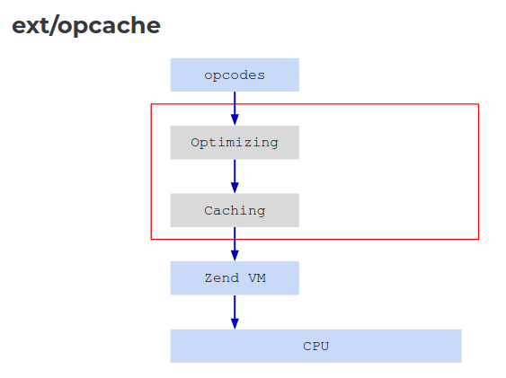
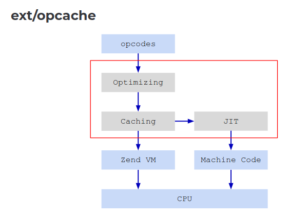

# JIT

https://wiki.php.net/rfc/jit-ir + https://wiki.php.net/rfc/jit_config_defaults

    - Since PHP 8.0
    - DynASM
    - Generate directly from Zend VM
    - x86
    - tracing (default) / function based







    - AArch84 backend in 8.1
    - Intermediate Representation (IR) in 8.4
    - https://github.com/dstogov/ir
    - less maintenance, more docs, faster and smaller code

Enable JIT with (>=8.4):

```
opcache.jit=tracing
opcache.jit_buffer_size=64m
```

    - No advantage at all for iO workloads
    - JIT follows another code path in the engine
    - Few JIT maintainers
