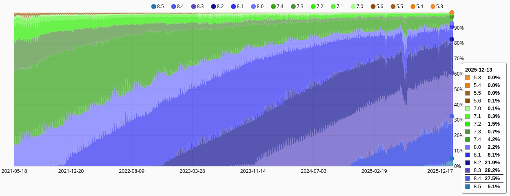
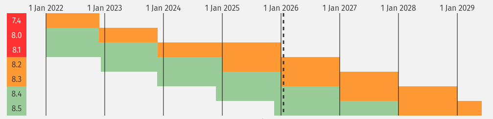

# 8.5

- 20 Nov 2025 https://www.php.net/archive/2025.php#2025-11-20-3

https://packagist.org/php-statistics

https://www.php.net/supported-versions.php

# Noteworthy

- OPcache is now a non-optional core component

# References

- https://www.php.net/releases/8.5/en.php
